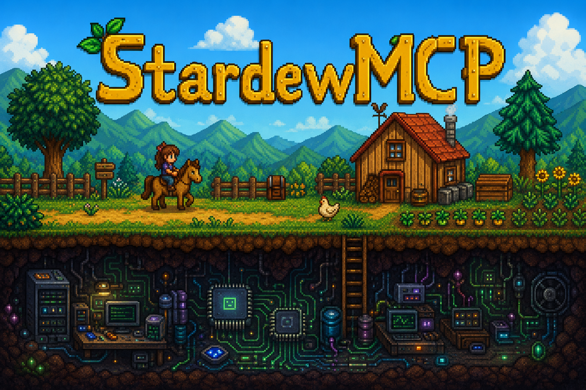

# StardewMCP



A SMAPI mod that runs a local MCP (Model Context Protocol) server inside Stardew Valley, letting AI assistants like Claude interact with your live game. Ask Claude to check what crops need watering, teleport you somewhere, give you items, or just describe what's around you.

Because MCP is an open protocol, StardewMCP is not just for chatting with an AI — it's a bridge between your game and anything that speaks MCP. Hook it up to a Twitch integration so viewers can vote on what happens next. Let a Discord bot relay messages from your friends directly into the game world. Build a companion app that reacts to your in-game state. Automate a farming routine from a script. The mod exposes the game; what you connect it to is up to you.

> **Safety:** By default all tools are active, including ones that modify your game. These are as powerful as any cheat or debug tool and can break things if misused. If you only want the AI to observe your game without making any changes, set `OnlyAllowObserveTools: true` in `config.json` — this restricts the mod to read-only tools only.

> **A note on quality:** This mod was built by an experienced software engineer primarily to explore AI code assistant capabilities and the MCP server protocol — not as a serious C# or modding project. It is only my second Stardew mod and C# is not my home turf. The code was written with significant AI assistance as part of that experiment. Bugs are likely, but the mod should generally work.

---

## Requirements

- [SMAPI](https://smapi.io/) 4.0.0 or newer
- Stardew Valley 1.6

---

## Installation

This mod can be safely added to or removed from an existing save at any time.

1. Install SMAPI if you haven't already.
2. Download the latest release and extract the `StardewMCP` folder into your `Mods` directory.
3. Launch the game through SMAPI. The mod starts an HTTP server on `http://localhost:24842` automatically.
4. Add the server to your MCP client config (e.g. Claude Desktop's `claude_desktop_config.json`):

```json
{
  "mcpServers": {
    "stardew": {
      "url": "http://localhost:24842"
    }
  }
}
```

5. Start a conversation with your AI — it will discover all available tools automatically.


## Tools

### Player

| Tool | Description |
|------|-------------|
| `get_player_info` | Location, tile, health, energy, money |
| `get_player_inventory` | Everything in the player's inventory with stack sizes |
| `add_item_to_inventory` | Add an item by name |
| `remove_item_from_inventory` | Remove an item by name |
| `equip_item` | Equip a hat, boots, ring, shirt, pants, or trinket. Leave `item_name` empty to clear a slot |
| `set_health` | Set current health |
| `add_money` | Add or remove gold (negative to remove) |
| `set_speed` | Set extra movement speed on top of the base |
| `set_skill_level` | Set farming / fishing / foraging / mining / combat level (0–10) |
| `add_recipe` | Unlock a crafting or cooking recipe by name |
| `add_profession` | Add a profession by numeric ID |
| `add_walnut` | Add golden walnuts (Ginger Island currency) |
| `upgrade_house` | Set farmhouse upgrade level (0 = starter, 3 = cellar) |
| `toggle_invincible` | Toggle damage immunity on/off |
| `player_emote` | Play an emote bubble (heart, sad, happy, etc.) |
| `send_hud_message` | Show a notification in the HUD |
| `show_speech_bubble` | Show a speech bubble above an NPC or monster |
| `teleport_player` | Warp to any location, optionally at specific coordinates |

### World & Time

| Tool | Description |
|------|-------------|
| `get_game_time` | Current season, day, year, and time of day |
| `set_time` | Set the clock (e.g. `8am`, `2:30pm`, `1800`) |
| `set_date` | Change day, season, and/or year |
| `advance_day` | Skip to the start of the next day |
| `pause_time` | Toggle the in-game clock on/off |
| `get_weather` | Today's weather and tomorrow's forecast |
| `set_weather` | Change weather: sunny, rain, thunderstorm, snow, windy |
| `warp_to_mine_floor` | Teleport directly to a mine floor (121+ = Skull Cavern) |
| `get_location_names` | List all valid location names |
| `get_location_warps` | List all exit tiles in a location with their destinations |
| `get_walkable_tiles` | Walkability grid centred on a tile, with warp markers |
| `get_surroundings` | Scan nearby NPCs, items, machines, crops, buildings, and interactive tiles |
| `clear_tile` | Remove trees, bushes, grass, rocks, twigs, or weeds from a specific tile |

### NPCs & Relationships

| Tool | Description |
|------|-------------|
| `get_npc_info` | Friendship, schedule, birthday, and relationship status |
| `get_npc_location` | Where a specific NPC is right now |
| `get_all_npc_locations` | Location of every villager |
| `get_npc_gift_preferences` | Loved and liked gifts for an NPC |
| `get_all_friendships` | Friendship summary for every NPC you've met |
| `get_upcoming_birthdays` | Birthdays in the next N days |
| `get_spouse_info` | Detailed info about your spouse |
| `set_npc_relationship` | Set friendship hearts with any NPC |

### Farm

| Tool | Description |
|------|-------------|
| `get_farm_info` | Crop state, buildings, animals, and machines on the farm |
| `grow_crops` | Advance all crops in the current location by N days |
| `befriend_animals` | Set farm animal friendship in the current location |

### Community Center & Progression

| Tool | Description |
|------|-------------|
| `get_bundle_status` | Every bundle with item-by-item donation status and rewards, organised by room |
| `complete_community_center` | Mark all Community Center rooms as done |
| `set_mail_flag` | Add or remove a mail flag to unlock game features |
| `manage_quest` | Add, complete, remove, or clear quests by ID |

### Items & World State

| Tool | Description |
|------|-------------|
| `find_item` | Search chests, furniture, and the ground for an item by name |
| `list_items` | List every stored item in the world |
| `list_registry_items` | Browse the game's item registry by type |

### Audio & Effects

| Tool | Description |
|------|-------------|
| `play_music` | Change the background music track (e.g. `spring1`, `rain`, `FlowerDance`). Use `none` to stop |
| `play_sound` | Play a one-shot sound effect by name, with optional pitch adjustment |
| `play_effect` | Play a visual effect at a tile position: `flash`, `glow`, `rainbow`, `sparkle`, `lightning` |

### Fishing

| Tool | Description |
|------|-------------|
| `get_catchable_fish` | List all fish catchable right now based on season, time, weather, and fishing level. Filter by location or see all at once |
| `get_fish_schedule` | Show every location and season a specific fish can be caught, with time window and weather conditions |

### Monsters

| Tool | Description |
|------|-------------|
| `spawn_monster` | Spawn one or more monsters at a position |
| `kill_all_monsters` | Remove all monsters from the current location |
